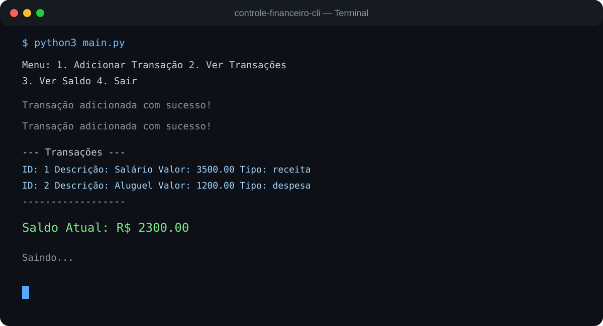

# Controle Financeiro CLI


[](https://www.python.org/)

[](https://www.sqlite.org/)

[](#)


Aplicação de linha de comando para controlo financeiro pessoal, desenvolvida em Python com persistência local em SQLite. Permite registar receitas e despesas, consultar o histórico e calcular o saldo actual através de um menu interactivo.


## Demonstração


A imagem abaixo apresenta uma execução real com registo de salário, aluguer, consulta de transacções e cálculo do saldo:





## Funcionalidades


- Registo de receitas e despesas com descrição, valor e tipo.
- 
- Listagem de transacções ordenadas por data.
- 
- Cálculo do saldo como receitas menos despesas.
- 
- Validação do tipo de transacção (`receita` ou `despesa`).
- 
- Persistência automática no ficheiro local `finance.db`.
- 


## Tecnologias


| Tecnologia | Utilização |

| --- | --- |

| Python | Lógica da aplicação e interface CLI |

| SQLite | Persistência local das transacções |


## Como executar


### 1. Clonar o repositório


```bash

git clone https://github.com/GustavoHCGit/controle-financeiro-cli.git

cd controle-financeiro-cli

```


### 2. Criar o ambiente


```bash

python -m venv venv

# Linux/macOS

source venv/bin/activate

# Windows PowerShell: .\venv\Scripts\Activate.ps1

```


### 3. Executar


```bash

python main.py

```


Na primeira execução, a tabela `transactions` é criada automaticamente na base de dados SQLite `finance.db`.


## Exemplo de utilização


```text

Menu:

1. Adicionar Transação

2. Ver Transações

3. Ver Saldo

4. Sair

Escolha uma opção: 3


Saldo Atual: R$ 2300.00

```


Para adicionar uma transacção, escolha `1`, informe a descrição, o valor e indique `receita` ou `despesa`. Use `2` para consultar o histórico e `3` para ver o saldo calculado.


## Estrutura do projecto


```text

.

├── main.py

├── requirements.txt

├── demo-terminal.svg

└── README.md

```
